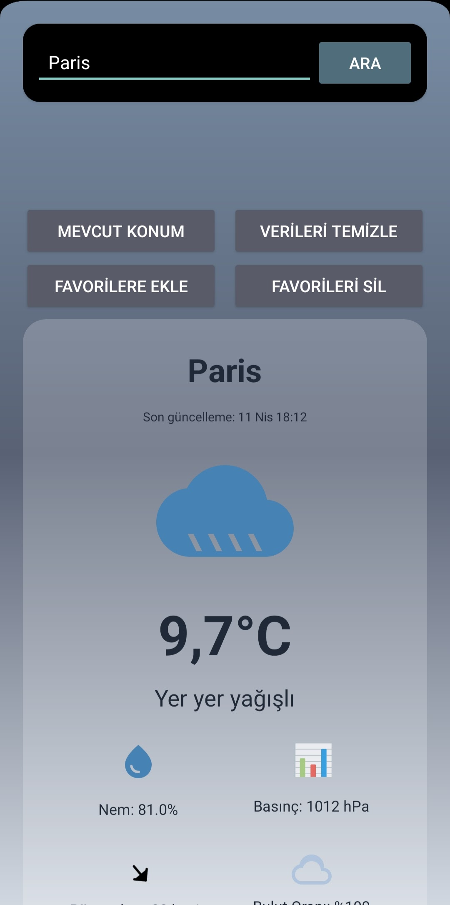
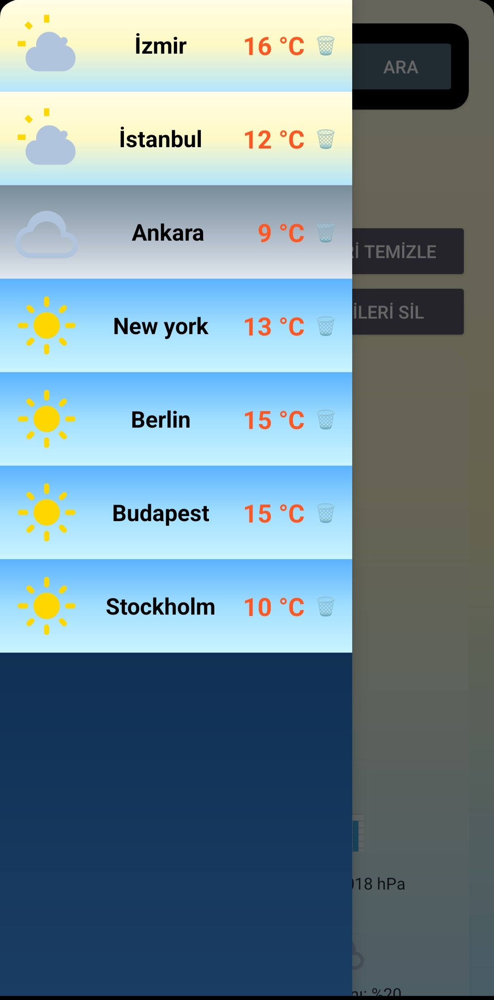
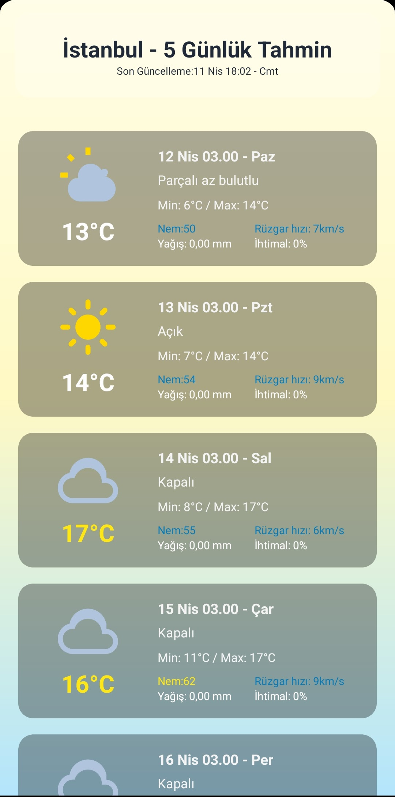

#  WeatherApp - AI Powered Weather Application

WeatherApp is a smart Android application that shows current, hourly, and 5-day weather forecasts. It uses the OpenWeatherMap API for weather data and **Google Gemini AI** to give you personalized daily advice based on the weather.

##  Features

* **Auto Location:** Automatically finds your current location and shows the weather.
* **City Search:** Fast city search with an offline local database.
* **Favorites:** Save your favorite cities for quick access (saved locally using Room Database).
* **Smart AI Advice:** Uses Google Gemini AI to give you clothing or activity tips based on the current weather (temperature, wind, rain, etc.).
* **Detailed Forecasts:**
  * **Current:** Temperature, feels like, humidity, wind speed, pressure, and cloudiness.
  * **Hourly:** 24-hour detailed forecast.
  * **5-Day:** Daily minimum/maximum temperatures and weather conditions.
* **Dynamic UI:** Backgrounds and icons change automatically depending on the weather (sunny, rainy, snowy, night/day).
* **Auto Updates:** Updates weather data in the background automatically.

##  Built With

* **Language:** Java
* **Minimum SDK:** 28 | **Target SDK:** 36
* **Network / API:** * **Volley:** For OpenWeatherMap API requests.
  * **Retrofit & Gson:** For Google Gemini AI requests.
* **Local Database:** **Room Database** (for favorite cities and search).
* **Location:** Google Play Services Fused Location.
* **Background Tasks:** Android **WorkManager**.

##  Project Structure

Here is the basic folder structure of the project:

```text
weatherapp2/
├── app/
│   ├── build.gradle.kts           # App-level build settings
│   └── src/
│       └── main/
│           ├── AndroidManifest.xml # App permissions and activities
│           ├── assets/
│           │   └── weather.db      # Pre-loaded city database
│           ├── java/com/example/weatherapp/
│           │   ├── MainActivity.java            # Main screen
│           │   ├── Forecastactivity.java        # 5-day forecast screen
│           │   ├── Hourlyforecastactivity.java  # 72-hour (forecast per 3-hour)forecast screen
│           │   ├── Helpers/                     # Tools for API, AI, and Auto-Updates
│           │   └── data/                        # Room Database tables and DAOs
│           └── res/
│               ├── layout/         # XML UI design files
│               ├── drawable/       # Background images and weather icons
│               └── values/         # Colors, strings, and themes
├── build.gradle.kts                # Project-level build settings
└── local.properties                # Hidden file for your secret API keys.
```


## Screenshots
| *Main Screen* | *Favori city list* | *5-day forecast screen* | *Main Screen with AI Advice* |
| :---: | :---: | :---: | :---: |
|  |  |  | src="appScreenshots/screenshotIgdirAIADvice.jpg" width="280"> |
